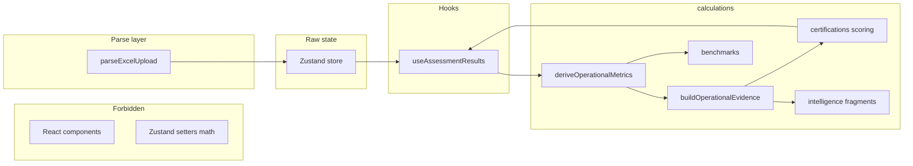
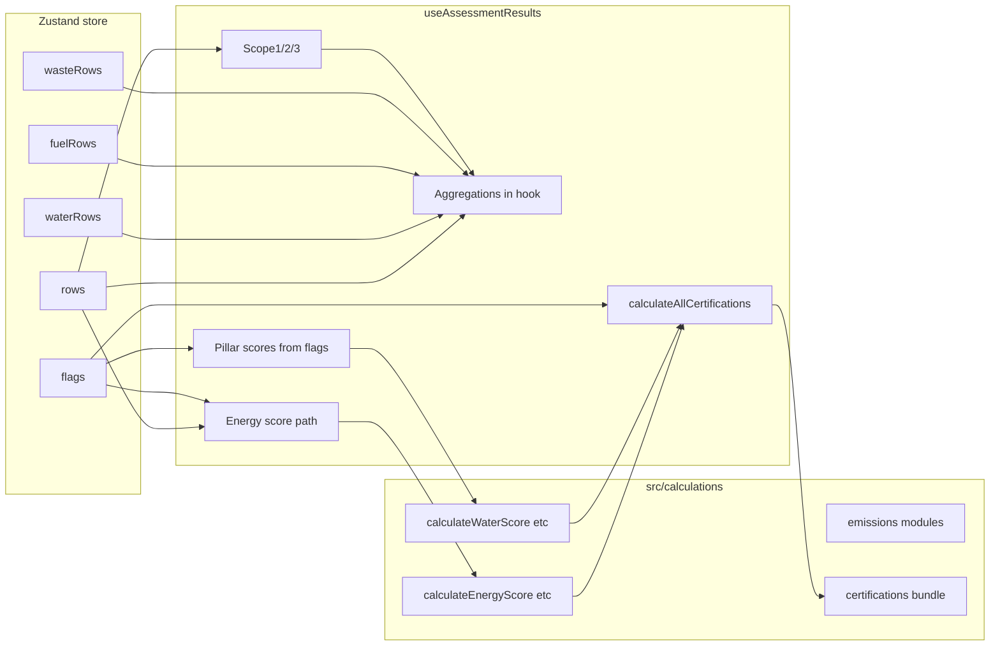
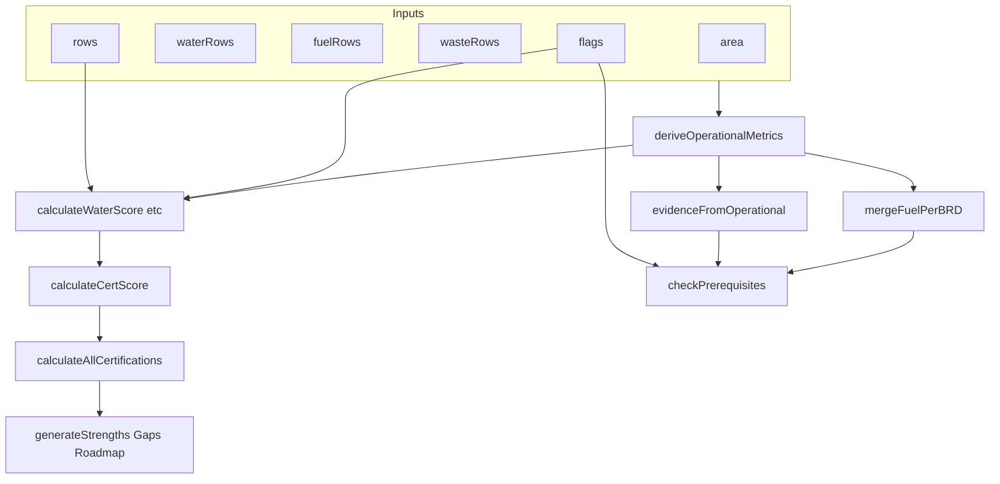

# Phase 2C — Operational Intelligence Integration (Planning Audit Only)

## 0. Operational Intelligence Contract Design (Phase A — architecture only)

This section is the **foundational operational intelligence contract** for the platform. It must be agreed before implementing derived metrics (Phase A implementation). **No code.** Prevents semantic drift, duplicated metrics, scattered dependencies, and hidden coupling.

### 0.1 Exact folder layout (canonical)

All **derived** operational intelligence lives under `frontend/src/calculations/`. Raw upload I/O may remain in `utils/`; **anything consumed by cert/readiness/benchmarks** crosses into `calculations/` only.

| Path | Ownership | Purpose |
|------|-------------|---------|
| [frontend/src/calculations/operational/](frontend/src/calculations/operational/) | **Calculations** | Pure derivation from raw row arrays + `area` + optional `uploadStatus`; **no** imports from React, Zustand, or `utils/generate*`. |
| `operational/contracts.js` (or `operationalTypes.js`) | **Calculations** | JSDoc typedefs / frozen field list for `OperationalRawSnapshot`, `OperationalDerivedMetrics`, `OperationalEvidence` (documentation + runtime shape contract for tests). |
| `operational/deriveOperationalMetrics.js` | **Calculations** | Single entry: snapshot in → `OperationalDerivedMetrics` out. |
| `operational/buildOperationalEvidence.js` | **Calculations** | Maps derived metrics + flags → boolean/string **evidence** keys consumed by prereqs and intelligence (BRD-mapped only). |
| `operational/mergeDieselForScope1.js` | **Calculations** | BRD-authoritative merge of `rows[].diesel` vs `fuelRows[].fuelDiesel` (one function, one rule). |
| `operational/validateOperationalSnapshot.js` | **Calculations** | Structural validation (12 months, numeric domains); returns `{ ok, errors[] }` without mutating store. |
| [frontend/src/calculations/orchestration/](frontend/src/calculations/orchestration/) | **Calculations** | Future **`computeAssessment(input)`** and any cross-domain assembly that is not cert-specific. |
| `orchestration/computeAssessment.js` | **Calculations** | **Future** single orchestration: accepts canonical `AssessmentInput`, returns `AssessmentOutput` (see 0.10). Initially thin wrapper delegating to existing functions. |
| [frontend/src/calculations/benchmarks/](frontend/src/calculations/benchmarks/) | **Calculations** | Shared benchmark evaluation (percentile bands, sector keys); **no** UI. |
| `benchmarks/benchmarkKeys.js` | **Calculations** | Re-exports or defines **shared benchmark key** constants (see 0.9). |
| [frontend/src/calculations/intelligence/](frontend/src/calculations/intelligence/) | **Calculations** | Pure composition for strengths/gaps/recommendations **fragments** that **consume** `OperationalEvidence` + existing scores; does **not** duplicate `calculateCertScore` weights. |
| [frontend/src/constants/operational/](frontend/src/constants/operational/) OR `constants/operationalUpload.schema.v1.js` | **Constants** | Sheet names, header aliases, schema **version** string, max row counts — **no formulas**. |

**Explicit non-ownership:** `frontend/src/utils/parseExcelUpload.js` remains **parse / normalize to store shapes only**; it must not grow cert or readiness logic. Optionally it imports **header constants** from `constants/operational/` to avoid string drift.

---

### 0.2 Canonical operational metric vocabulary

Metrics fall into **three namespaces** to prevent drift:

| Namespace | Prefix | Meaning | Example identifiers |
|-----------|--------|---------|---------------------|
| **RAW_ROW_FIELD** | (none; fixed by store) | Keys on `rows`, `waterRows`, `fuelRows`, `wasteRows` | `elec`, `totalWater`, `fuelDiesel`, `biomedical` |
| **DERIVED_METRIC** | `dm` (object key prefix in `OperationalDerivedMetrics`) | Pure numeric / count derived from raw | `dmFilledElectricityMonths`, `dmTotalElectricityKWh`, `dmTotalWaterKL`, `dmTotalWasteKg`, `dmTotalBiomedicalWasteKg`, `dmDieselLitresElectricitySheet`, `dmDieselLitresFuelSheet`, `dmDieselLitresScope1` (after merge) |
| **EVIDENCE_KEY** | `ev` (in `OperationalEvidence`) | Boolean or enum consumed by prereqs / narrative | `evWaterDataSixMonths`, `evScope1MassBalanceOk` |

**Rule:** Never use the same **display name** for two IDs (e.g. avoid both `totalWater` and `totalWaterVolume` meaning different things). Store keeps `totalWater` on rows; derived document uses `dmTotalWaterKL` only if BRD defines KL; otherwise `dmTotalWater` with **unit in constant** `OPERATIONAL_UNIT.water = 'KL'`.

**Minimum v1 derived set (contract surface):**

- Electricity: `dmFilledElectricityMonths`, `dmTotalElectricityKWh`, `dmTotalRenewableKWh`, `dmDieselLitresElectricitySheet`, `dmTotalCostInr` (if needed for narrative only).
- Water: `dmFilledWaterMonths`, `dmTotalWater` (unit from constant), optional splits `dmWaterMunicipalSum` … only if BRD references them.
- Fuel: `dmFilledFuelMonths`, `dmDieselLitresFuelSheet`, `dmTotalPngKg`, `dmAvgRuntimeHours` (narrative-only unless BRD binds).
- Waste: `dmFilledWasteMonths`, `dmTotalWasteKg`, `dmTotalBiomedicalWasteKg`, `dmTotalHazardousWasteKg`.
- Cross: `dmDieselLitresScope1` = output of `mergeDieselForScope1` only — **single** Scope 1 diesel input for emissions + BRSR prereq alignment.

---

### 0.3 Naming governance

| Layer | Convention | Rule |
|-------|------------|------|
| Zustand fields | `camelCase`, existing names frozen | `rows`, `waterRows`, `fuelRows`, `wasteRows`, `uploadStatus` — **do not rename**; extend with new keys only via ADR. |
| Store `uploadStatus` keys | match **category id** from UI config | `electricity`, `water`, `fuel`, `waste` — must equal [energy.module.jsx](frontend/src/modules/assessment/configs/energy.module.jsx) `cat.id`. |
| Derived metrics object | `OperationalDerivedMetrics` with `dm*` keys | All new derived scalars use `dm` prefix inside this object only. |
| Evidence object | `OperationalEvidence` with `ev*` keys | Prereq bridge keys; must **map 1:1** to entries in [certificationPrerequisites](frontend/src/constants/certificationPrerequisites.js) **or** explicitly marked `NARRATIVE_ONLY`. |
| Cert / benchmark constants | `SCREAMING_SNAKE` in `constants/` | `CERT_ID`, `BENCHMARK_KEY_HEALTHCARE_OVERALL_QUARTILE`, etc. |
| Functions | `verbNoun` pure | `deriveOperationalMetrics`, `buildOperationalEvidence`, `mergeDieselForScope1`. |

**Forbidden:** duplicate names for “months with data” across domains without prefix (`filledMonths` today means electricity only — derived contract must use `dmFilledElectricityMonths` in new code paths to avoid semantic collision).

---

### 0.4 Certification dependency matrix (contract view)

Rows = **dependency channel**; columns = **cert IDs** (from [sectorCertifications](frontend/src/constants/sectorCertifications.js) + weights in [certificationWeights](frontend/src/constants/certificationWeights.js)).

| Channel | NABH | IGBC_HEALTHCARE | LEED_HEALTHCARE | ISO_14001 | WELL | BRSR | GRI | ISO_50001 |
|---------|------|-----------------|-----------------|-----------|------|------|-----|-----------|
| Pillar scores (`calculateCertScore`) | Y | Y | Y | Y | Y | Y | Y | Y |
| Prereq `checkPrerequisites` | Y | Y | Y | Y | Y | Y | — | — |
| `filledMonths` (electricity) | — | Y (energy tracking) | — | — | — | — | — | — |
| `totalElec` / `totalDiesel` (BRSR scope) | — | — | — | — | — | Y | — | — |
| Flags only | Y | Y | Y | Y | Y | partial | partial | partial |
| **OperationalDerived (future)** | TBD BRD | TBD | TBD | TBD | TBD | TBD | — | — |

**Contract rule:** Any new operational influence must declare **which cells** it fills (pillar vs prereq vs narrative-only) per cert in a single table file `constants/operational/CERT_OPERATIONAL_DEPENDENCY.v1.md` (or `.js` export for tests) — **source of truth** to prevent hidden coupling.

---

### 0.5 Operational evidence contracts (exact shapes)

**A. `OperationalRawSnapshot` (input to calculations; built in hook from store, no math)**

```text
{
  rows: RowElectricity[],      // store shape
  waterRows: RowWater[],
  fuelRows: RowFuel[],
  wasteRows: RowWaste[],
  flags: Record<string, unknown>,
  areaSqFt: number,
  uploadStatus: Record<string, UploadStatusEntry>,
  schemaVersion: string       // e.g. 'operational-upload.v1'
}
```

**B. `OperationalDerivedMetrics` (output of `deriveOperationalMetrics`)**

- All fields numeric or integer counts; **no booleans** except where BRD defines a derived threshold as a number (prefer 0/1 as number to keep type flat, or use Evidence object for booleans).
- Must be **serializable** for future backend echo / audit.

**C. `OperationalEvidence` (output of `buildOperationalEvidence`)**

- Keys are **stable string enums** from a closed set `EVIDENCE_KEYS` in `calculations/operational/contracts.js`.
- Values: `boolean` or `{ level: 'MET'|'PARTIAL'|'NOT_MET', detail?: string }` for narrative-safe expansion.
- **Consumer contract:** `checkPrerequisites` accepts optional `operationalEvidence?: OperationalEvidence`; when `undefined`, behavior **identical** to current production.

**D. `PrerequisiteEvaluationContext` (internal merge, optional file `certifications/prerequisiteContext.js`)**

- Single struct: `{ flags, filledElectricityMonths, totalElec, totalDieselScope1, evidence }` produced by pure `buildPrerequisiteContext(flags, derived, evidence)` so `checkPrerequisites` does not grow 12 parameters.

---

### 0.6 Metric ownership boundaries



| Concern | Owner |
|---------|-------|
| CSV/XLSX bytes → row arrays | `parseExcelUpload` + constants for headers |
| Row arrays in memory | Zustand |
| Sums, counts, merges, validation | `calculations/operational/*` |
| BRD weights, caps, timelines | `calculations/certifications/*` (existing) |
| Benchmark percentile | `calculations/benchmarks/*` |
| Strength/gap **text** assembly | `calculations/intelligence/*` composing with existing `generateResultsInsights` outputs |
| Wiring order only | `useAssessmentResults` |

---

### 0.7 Upload schema governance strategy

- **Version string:** `OPERATIONAL_UPLOAD_SCHEMA_VERSION = '1.0.0'` in `constants/operational/schema.js`.
- **Sheet registry:** canonical names `Electricity`, `Water`, `Fuel`, `Waste` as constants; parser imports registry.
- **Header alias map:** each sheet has `PRIMARY_HEADERS` + `ALIASES` (e.g. `Month` / `month`) in constants — **single file** per schema version; bump version when aliases or columns change.
- **Migration policy:** new columns require **minor** version bump; breaking row shape requires **major** bump and optional normalizer `normalizeOperationalRowsV1toV2` in `operational/` if ever needed.
- **Parser rule:** `parseExcelUpload` emits only **RAW_ROW_FIELD** shapes; never emits `dm*`.

---

### 0.8 Evidence confidence architecture compatibility

Existing confidence model: [confidenceModifiers](frontend/src/constants/confidenceModifiers.js) + `filledMonths` (electricity) in scoring path.

**Contract:**

- **Tier A (data sufficiency for scoring):** continues to use **electricity** `filledMonths` / `getConfidenceModifier` for **energy score** only — unchanged unless BRD extends.
- **Tier B (operational channel sufficiency):** separate optional fields on `OperationalEvidence` or `OperationalDerivedMetrics`: e.g. `dmWaterConfidenceMonths`, each with **explicit** BRD rule (do not overload `getConfidenceModifier` without BRD).
- **Rule:** Do not imply operational Excel implies 12-month confidence for pillars until BRD says so; avoid coupling upload to `isDataValid` unless defined.

---

### 0.9 Cross-certification dependency mapping (shared prereq keys)

Shared **prerequisite keys** from [checkPrerequisites](frontend/src/calculations/certifications/checkPrerequisites.js) keyMap affect multiple certs:

| Evidence / flag key | Certs affected |
|---------------------|----------------|
| `energyTracking6Months` | IGBC_HEALTHCARE |
| `waterTracking6Months` | IGBC_HEALTHCARE |
| `energyMonitoringSystem` | LEED_HEALTHCARE |
| `waterMeteringBySource` | LEED_HEALTHCARE |
| `policy`, `esgOwner`, `compliance` | ISO_14001, BRSR (esgOwner) |
| `scope1Available`, `scope2Available` | BRSR |
| Biomedical trio | NABH |

**Contract:** `buildOperationalEvidence` outputs **atomic** evidences; `buildPrerequisiteContext` applies **one** composition rule (OR / AND / OVERRIDE) per key with BRD comment. **No cert-specific branching inside evidence builder** — cert specificity stays in `CERTIFICATION_PREREQUISITES` data.

---

### 0.10 Shared benchmark key definitions

Centralize in `calculations/benchmarks/benchmarkKeys.js` (or `constants/benchmarks.js` for static numbers only):

| Key | Description | Typical inputs |
|-----|-------------|----------------|
| `BENCHMARK_HEALTHCARE_OVERALL_SCORE` | Sector default comparison for overall | `scores.overall` |
| `BENCHMARK_ENERGY_INTENSITY_KWH_PER_SQFT` | Already used in insights threshold 22 | `scores.intensity` |
| `BENCHMARK_RENEWABLE_PCT` | 10% threshold | `scores.renPct` |
| `BENCHMARK_WATER_OPERATIONAL_INTENSITY` | **Future** — only if BRD defines KL/sqft from `dmTotalWater` + area | derived + area |

**Rule:** UI never defines thresholds; components receive **pre-evaluated** `{ key, band, label }[]` from hook calling `evaluateBenchmarks(derived, scores, sector)`.

---

### 0.11 Future orchestration compatibility with `computeAssessment()`

**Goal:** `computeAssessment(AssessmentInput): AssessmentOutput` becomes the **single** pure orchestration boundary for SSR, tests, and optional future worker — **thin** at first.

**AssessmentInput (canonical):**

- `snapshot: OperationalRawSnapshot`
- `sector: string` (auth context; passed in, not read from store inside pure fn)
- `options?: { includeIntelligence: boolean }`

**AssessmentOutput (canonical):**

- `derived: OperationalDerivedMetrics`
- `evidence: OperationalEvidence`
- `scores` (same shape as today’s `scores` object from hook)
- `certificationResults` (existing shape from `calculateAllCertifications`)
- `intelligence?: { strengths, gaps, roadmap }` (composed)
- `benchmarks?: BenchmarkEvaluation[]`

**Compatibility rule:** `useAssessmentResults` becomes a **thin** subscriber that builds `AssessmentInput` from stores and calls `computeAssessment`; **no** duplicated orchestration logic left in the hook after migration.

---

### 0.12 Anti-drift controls (platform rules)

1. **Single dependency table** for cert × operational (0.4 file export).
2. **No metric without an owner file** (operational vs cert vs benchmark vs intelligence).
3. **Forbidden imports:** `calculations/**` must not import from `components/**` or `modules/**/store`.
4. **Diff policy:** PRs that add a new `dm*` must add a row to the vocabulary table in the same PR.

---

## Phase 1 — Current system audit

### 1. Upload pipeline (as implemented)

| Stage | Location | Responsibility |
|--------|----------|------------------|
| File pick / dispatch | [frontend/src/modules/assessment/hooks/useFileUpload.js](frontend/src/modules/assessment/hooks/useFileUpload.js) | MIME/name validation; calls parser; `setRows` / `setWaterRows` / `setFuelRows` / `setWasteRows`; `setUploadStatus` |
| Parse | [frontend/src/utils/parseExcelUpload.js](frontend/src/utils/parseExcelUpload.js) | XLSX read; sheets `Electricity`, `Water`, `Fuel`, `Waste`; normalizes to 12× month rows |
| Persistence | [frontend/src/modules/assessment/store/assessment.store.js](frontend/src/modules/assessment/store/assessment.store.js) | `rows`, `waterRows`, `fuelRows`, `wasteRows`, `uploadStatus` |

**Row shapes (contract today)**

- **Electricity `rows`:** `{ month, elec, ren, diesel, cost }` — feeds energy path, emissions (`totalDiesel` from these rows), `filledMonths` (months with `elec > 0`).
- **`waterRows`:** `{ month, municipal, tanker, borewell, recycled, totalWater }`.
- **`fuelRows`:** `{ month, fuelDiesel, png, runtime }`.
- **`wasteRows`:** `{ month, wet, dry, biomedical, hazardous, totalWaste }`.

### 2. Existing calculation flow (trace)



- **Energy / emissions / overall readiness:** driven by `rows` + `flags` + existing pure functions under [frontend/src/calculations/](frontend/src/calculations/) (energy, scoring, emissions). **Electricity upload already affects** intensity, renewable %, confidence-modified energy score, Scope 1 from `rows[].diesel`, Scope 2 from `totalElec`.
- **Water / waste pillar scores:** [frontend/src/calculations/scoring/calculateReadiness.js](frontend/src/calculations/scoring/calculateReadiness.js) — **flags only**; `waterRows` / `wasteRows` **do not** change `water` or `waste` scores today.
- **Certification scores:** [frontend/src/calculations/certifications/calculateCertScore.js](frontend/src/calculations/certifications/calculateCertScore.js) uses `{ energy, water, waste, governance }` — same flag-derived pillars; **operational totals do not enter**.
- **Prerequisites:** [frontend/src/calculations/certifications/checkPrerequisites.js](frontend/src/calculations/certifications/checkPrerequisites.js) uses `flags`, `filledMonths` (electricity), `totalElec`, `totalDiesel` (from electricity rows). **`waterTracking6Months` is `flags.wTrack`**, not `filledWaterMonths` from `waterRows`.
- **Timelines / cert status labels:** derived from capped cert score in [frontend/src/calculations/certifications/getTimeline.js](frontend/src/calculations/certifications/getTimeline.js) / `getReadinessStatus` — only as good as cert inputs above.
- **Recommendations (Results):** [frontend/src/utils/generateResultsInsights.js](frontend/src/utils/generateResultsInsights.js) — **pure**, uses `scores` + `flags`; scores today lack operational semantics for water/waste beyond intensity/renPct.
- **Dashboard analyst:** [frontend/src/components/intelligence/ESGAnalystPanel.jsx](frontend/src/components/intelligence/ESGAnalystPanel.jsx) calls [frontend/src/utils/generateInsights.js](frontend/src/utils/generateInsights.js) — pillar scores only.
- **Benchmark strip:** [frontend/src/components/intelligence/BenchmarkStrip.jsx](frontend/src/components/intelligence/BenchmarkStrip.jsx) contains **inline** `computePercentile` and static `BENCHMARKS` — **not** driven by operational uploads.

### 3. Certification engine dependency map (per cert family)

| Cert ID (examples) | `calculateCertScore` inputs | `checkPrerequisites` inputs | Operational data used today | Gaps / strengths |
|--------------------|----------------------------|------------------------------|----------------------------|------------------|
| NABH | Same 4 pillars | `authVendor`, `sops`, `wtTrack` | None from `wasteRows` | [generateResultsInsights](frontend/src/utils/generateResultsInsights.js) uses flags + scores only |
| IGBC_HEALTHCARE | Same 4 pillars | `filledMonths >= 6`, `wTrack` | Electricity months only for energy prereq; water **flag** not `waterRows` | Same |
| LEED_HEALTHCARE | Same 4 pillars | `hasBMS`, `wSplit` | None from uploads | Same |
| ISO_14001 | Same 4 pillars | `policy`, `esgOwner`, `compliance` | `totalElec`/`totalDiesel` for BRSR-style scope keys only on BRSR row | Same |
| WELL | Same 4 pillars | `iaqMonitoring` flag | None | Same |
| BRSR | Same 4 pillars | `esgOwner`, scope1/2 from elec/diesel totals | Electricity path only | Same |

**Important:** [calculateCertScore.js](frontend/src/calculations/certifications/calculateCertScore.js) uses **proxies** `indoorEnv = governance` and `evidence = round((energy+governance)/2)` — operational IAQ/waste evidence is **not** modeled there (explicit TODO in file).

### 4. Disconnected operational evidence (confirmed)

| Uploaded signal | Currently affects | Gap |
|-----------------|-------------------|-----|
| `waterRows` / `totalWater` / month fill | Only exposed as `scores.totalWater`, `filledWaterMonths` from hook | **Not** `calculateWaterScore`, **not** `waterTracking6Months` prereq, **not** insights |
| `wasteRows` / biomedical / totals | `scores.totalWaste`, `totalBiomedical` | **Not** `calculateWasteScore`, **not** NABH biomedical prereq keys (those read flags) |
| `fuelRows` / `fuelDiesel` | `scores.totalFuelDiesel` | **Not** `calculateScope1` (still uses `rows[].diesel` only) — **risk of dual diesel semantics** |
| PNG / runtime | Stored per row | Unused anywhere downstream |
| Municipal/tanker splits | Stored | Unused |

---

## Phase 2 — Architecture gap analysis

| Risk type | Detail |
|-----------|--------|
| **Rule violations** | Aggregations (`reduce` / `filter` for totals) live in [useAssessmentResults.js](frontend/src/modules/assessment/hooks/useAssessmentResults.js) — violates stated rule “ALL calculations in `/src/calculations/`”. |
| **Duplication** | Diesel in `rows.diesel` vs `fuelRows.fuelDiesel` — two sources of truth for fuel unless BRD defines a single merge rule. |
| **Regression** | Any change to `checkPrerequisites` / `calculateAllCertifications` signatures affects all certs; blending operational into flags in the store would blur SSOT and break reset semantics. |
| **Tight coupling** | Certification + insights scattered across `calculations/certifications`, `utils/generate*`, and UI; operational metrics would amplify coupling if patched ad hoc in components. |
| **Missing abstraction** | No single **OperationalEvidence** or **DerivedOperationalMetrics** contract consumed by prereqs, pillar scores, and insights. |
| **Component logic** | `BenchmarkStrip` embeds benchmark math — should move to `calculations/` (or `constants/` for static tables + `calculations/` for percentile) when “operational benchmarks” are introduced. |
| **BRD alignment** | Mapping operational rows → pillar scores or prereqs **must** be BRD-sourced; cannot invent formulas in hooks or components. |

---

## Phase 3 — Safe integration design (extend, do not rewrite formulas)

### Design principles

1. **Single derived contract** produced by pure functions from `(rows, waterRows, fuelRows, wasteRows, flags, area)` — no business logic in Zustand or React.
2. **Explicit merge rules** for diesel / PNG documented in one place (constants + pure merge function) to avoid double counting.
3. **Extend function signatures** in small steps: add optional `operationalMetrics` (or decomposed fields) to **prerequisite** and **insight** layers first; touch `calculateCertScore` / pillar **only** when BRD defines how operational data adjusts scores (otherwise only prereqs + narrative evidence).

### Proposed folder / file layout (new)

Under [frontend/src/calculations/](frontend/src/calculations/):

| Path | Role |
|------|------|
| `operational/deriveOperationalMetrics.js` | Pure: month counts, totals, intensity-style metrics **that BRD allows** from row shapes; returns frozen-shaped object (e.g. `filledWaterMonths`, `totalWaterKL`, `wasteDiversionProxy`, `combinedDieselLitres` per BRD). |
| `operational/mergeFuelTotals.js` (or `resolveScope1Diesel.js`) | Pure: BRD-defined precedence between DG column in electricity vs fuel sheet. |
| `operational/evidenceFromOperational.js` | Pure: maps metrics + flags → **evidence booleans** for prereqs (e.g. “water tracking 6 months” from rows vs flag) **without** duplicating cert weight math. |
| `operational/index.js` | Barrel exports. |

**Orchestration point:** [useAssessmentResults.js](frontend/src/modules/assessment/hooks/useAssessmentResults.js) should only **call** `deriveOperationalMetrics(...)` and pass outputs into existing calculation functions — **not** implement reduces inline after refactor.

**Contract sketch (illustrative names — finalize against BRD):**

```ts
// pseudocode contract only
OperationalMetrics {
  electricity: { filledMonths, totalElec, totalRen, totalDieselFromGridSheet, ... },
  water: { filledMonthsWithData, annualizedTotalKL, ... },
  waste: { totalWasteKg, biomedicalKg, ... },
  fuel: { totalDieselLitres, totalPngKg, ... },
  evidence: { waterTrackingOperational: boolean, ... }  // BRD-driven only
}
```

**Integration into existing engine (no formula rewrite):**

- **Prerequisites:** extend `checkPrerequisites(certId, flags, filledMonths, totalElec, totalDiesel, operationalEvidence?)` — default `operationalEvidence` absent preserves current behavior; when present, **OR** or **replace** specific keyMap entries per BRD (e.g. `waterTracking6Months = flags.wTrack OR evidence.waterSixMonthsOperational`).
- **calculateAllCertifications:** pass through extra arg only; **no change** to weight tables unless BRD says operational adjusts weighted score.
- **Pillar scores:** if BRD says operational data adjusts `calculateWaterScore` / `calculateWasteScore`, extend those functions **in place** with optional second argument `operationalMetrics` defaulting to “no effect” — preserves existing call sites from [useAssessmentScoring.js](frontend/src/modules/assessment/hooks/useAssessmentScoring.js) if still used elsewhere.
- **Insights / recommendations:** prefer **new** pure module under `calculations/intelligence/` (e.g. `buildOperationalInsightFragments.js`) that returns structured bullets; **compose** with existing [generateResultsInsights.js](frontend/src/utils/generateResultsInsights.js) in the hook **or** add an optional third parameter `operationalMetrics` to generators **only if** product accepts touching those files — otherwise wrap at hook level: `combineInsights(base, operational)` in `calculations/intelligence/combineInsights.js`.

**Benchmarks:** move percentile + band logic from [BenchmarkStrip.jsx](frontend/src/components/intelligence/BenchmarkStrip.jsx) to `calculations/benchmarks/evaluateBenchmarkPosition.js`; component receives precomputed `{ label, band }`.

---

## Phase 4 — Safe implementation order

| Step | Section | Files likely touched | Depends on | Regression risk | Testing |
|------|---------|----------------------|------------|-----------------|---------|
| 1 | **Derived metrics layer** | New `calculations/operational/*`; refactor [useAssessmentResults.js](frontend/src/modules/assessment/hooks/useAssessmentResults.js) to call derive only | None | Low if outputs match current hook aggregates for default mock data | Snapshot/compare `scores.totalWater` etc. before/after |
| 2 | **Diesel / Scope 1 merge** | `mergeFuelTotals` + [calculateScope1](frontend/src/calculations/emissions/calculateScope1.js) caller only (hook passes combined litres) **or** single pre-pass in derive | Step 1 | **High** if merge wrong | Golden: Scope1 with only elec diesel vs only fuel sheet vs both |
| 3 | **Benchmark layer** | New `calculations/benchmarks/*`; slim [BenchmarkStrip.jsx](frontend/src/components/intelligence/BenchmarkStrip.jsx) | Step 1 optional | Low | UI renders same labels for fixed scores |
| 4 | **Prerequisite integration** | [checkPrerequisites.js](frontend/src/calculations/certifications/checkPrerequisites.js), [calculateAllCertifications.js](frontend/src/calculations/certifications/calculateAllCertifications.js), [useAssessmentResults.js](frontend/src/modules/assessment/hooks/useAssessmentResults.js) | Step 1 + BRD key map | Medium | Matrix: each prereq key toggled operational vs flag |
| 5 | **Gap integration** | New `calculations/intelligence/*` or extend `generateGaps` via wrapper | Step 1, BRD copy | Medium | Upload sparse water → expect gap text |
| 6 | **Strength integration** | Same as gaps | Step 1 | Medium | Upload strong water pattern → strength appears |
| 7 | **Recommendation integration** | Compose roadmap/strengths; avoid duplicating strings | Steps 5–6 | Medium | Order and max length unchanged |
| 8 | **Timeline integration** | Only if cert scores change; else no-op | Step 4 | Low–Med | Score brackets 35/65/80 still match `getTimeline` / `getReadinessStatus` |
| 9 | **Validation layer** | New `calculations/operational/validateUploadConsistency.js` (row count, month keys, negative numbers); surface errors beside [useFileUpload](frontend/src/modules/assessment/hooks/useFileUpload.js) | Parser output | Low | Invalid workbook → user-visible errors, store unchanged |

---

## Phase 5 — Test strategy

### Regression checklist

- Default mock: overall score, energy/water/waste/gov pillars, Scope 1/2/3, cert list for `HOSP`, prereq caps unchanged when no upload.
- Excel upload electricity only: `rows` update; emissions and energy path match manual calculation samples (existing BRD checks).
- Reset wizard: all row types + `uploadStatus` return to mock defaults.

### BRD validation checklist

- Every new boolean or numeric blend references BRD section ID in code comment or constants file.
- No new weights in `CERTIFICATION_WEIGHTS` without BRD §13.3 amendment.
- Prereq cap still `min(score, 74)` when prereqs fail.

### Upload validation checklist

- Missing sheet → parser errors + zero rows; store not partially corrupted.
- Month label variants (`Jan`, `January`) — [parseExcelUpload.js](frontend/src/utils/parseExcelUpload.js) `monthMatch` behavior.
- CSV vs xlsx MIME quirks (empty `file.type`).

### Certification validation checklist

- For each cert with prereqs: operational override produces same result as flag-only when evidence absent (backward compatibility).
- BRSR `scope1Available` / `scope2Available` still coherent after diesel merge.

### Readiness validation checklist

- Overall readiness label (`calculateReadiness`) only changes when pillar scores change per BRD — track whether Phase 2C is allowed to change pillars vs only narrative.

---

## Dependency graph (cert + operational — target state)



---

## Identified risks (summary)

- **Dual diesel paths** causing wrong Scope 1 or double counting.
- **Silent changes** to cert scores if pillars start consuming operational data without explicit BRD thresholds.
- **Touching forbidden files** in future phases (past project rules excluded some generators — confirm Phase 2C file allowlist before editing `generateResultsInsights.js`).
- **Hook bloat** if orchestration is not moved behind pure `derive*` functions.

## Missing data dependencies (need BRD / product answers before coding)

- Should `waterTracking6Months` reflect **flags**, **operational rows**, or **either**?
- Should Scope 1 diesel be **sum** of electricity-sheet DG + fuel-sheet diesel, **max**, or **electricity-only**?
- Should PNG (`fuelRows.png`) feed a separate Scope 1 pathway (not currently in [calculateScope1.js](frontend/src/calculations/emissions/calculateScope1.js))?
- Do waste operational totals adjust **waste pillar score**, or only **NABH** / narrative gaps?
- Indoor environment: still proxy on governance until IAQ data model exists — confirm no premature change to `calculateCertScore` weights.

## Recommended abstractions

1. **`OperationalMetrics` + `OperationalEvidence`** pure objects from `calculations/operational/`.
2. **`combinePrerequisiteInputs(flags, evidence)`** in `calculations/certifications/` to keep `checkPrerequisites` readable.
3. **Insight composition** in `calculations/intelligence/` to avoid growing monolithic `generateResultsInsights.js` without a spec.
